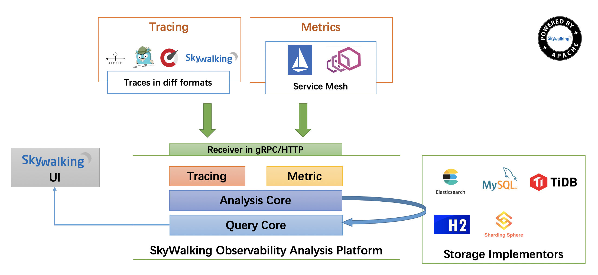

Apache SkyWalking
==========

# SkyWalking8.7
SkyWalking8.7版本源码解析

**SkyWalking**: 一种 APM（应用程序性能监控器）系统，专为微服务、云原生和基于容器(Docker、K8s、Mesos)的架构而设计。

 - Agent端
 - OAP端

[模块结构](oap-server%2FREADME.md)

# Abstract
**SkyWalking** is an open source APM system, including monitoring, tracing, diagnosing capabilities for distributed system
in Cloud Native architecture.
The core features are following.

- Service, service instance, endpoint metrics analysis
- Root cause analysis. Profile the code on the runtime
- Service topology map analysis
- Service, service instance and endpoint dependency analysis
- Slow services and endpoints detected
- Performance optimization
- Distributed tracing and context propagation
- Database access metrics. Detect slow database access statements(including SQL statements)
- Alarm
- Browser performance monitoring
- Infrastructure(VM, network, disk etc.) monitoring
- Collaboration across metrics, traces, and logs

SkyWalking supports to collect telemetry (metrics, traces, and logs) data from multiple sources
and multiple formats,
including
1. Java, .NET Core, NodeJS, PHP, and Python auto-instrument agents.
1. Go and C++ SDKs.
1. LUA agent especially for Nginx, OpenResty and Apache APISIX.
1. Browser agent.
1. Service Mesh Observability. Control panel and data panel. 
1. Metrics system, including Prometheus, OpenTelemetry, Spring Sleuth(Micrometer), Zabbix.
1. Logs.
1. Zipkin v1/v2 trace.(No Analysis)

SkyWalking OAP is using the STAM(Streaming Topology Analysis Method) to analysis topology in the tracing based agent scenario 
for better performance. Read [the paper of STAM](https://wu-sheng.github.io/STAM/) for more details.

# Documentation
- [Official documentation](https://skywalking.apache.org/docs/)
- [The paper of STAM](https://wu-sheng.github.io/STAM/), Streaming Topology Analysis Method.
- [Blog](https://skywalking.apache.org/blog/2020-04-13-apache-skywalking-profiling/) about Use Profiling to Fix the Blind Spot of Distributed Tracing
- [Blog](https://skywalking.apache.org/blog/2020-12-03-obs-service-mesh-with-sw-and-als/) about observing Istio + Envoy service mesh with ALS solution.
- [Blog](https://skywalking.apache.org/blog/obs-service-mesh-vm-with-sw-and-als/) about observing Istio + Envoy service mesh with ALS Metadata-Exchange mechanism (in VMs and / or Kubernetes).
- [官方文档](https://github.com/apache/skywalking/tree/master/docs)
- [中文存根](https://github.com/SkyAPM/document-cn-translation-of-skywalking)
- [opentracing](https://github.com/opentracing-contrib/opentracing-specification-zh)
- [OAL扩展](https://www.cnblogs.com/switchvov/p/15146092.html)
- [环境搭建](https://skywalking.apache.org/zh/2020-04-19-skywalking-quick-start/)

NOTICE, SkyWalking 8.0+ uses [v3 protocols](docs/en/protocols/README.md). They are incompatible with previous releases.

# Downloads
Please head to the [releases page](https://skywalking.apache.org/downloads/) to download a release of Apache SkyWalking.

# Compiling project
Follow this [document](docs/en/guides/How-to-build.md).

# Code of conduct
This project adheres to the Contributor Covenant [code of conduct](https://www.apache.org/foundation/policies/conduct). By participating, you are expected to uphold this code.
Please follow the [REPORTING GUIDELINES](https://www.apache.org/foundation/policies/conduct#reporting-guidelines) to report unacceptable behavior.

# Live Demo
Find the [demo](https://skywalking.apache.org/#demo) and [screenshots](https://skywalking.apache.org/#arch) on our website.

**Video on youtube.com**

# Contact Us
* Mail list: **dev@skywalking.apache.org**. Mail to `dev-subscribe@skywalking.apache.org`, follow the reply to subscribe the mail list.
* Join `skywalking` channel at [Apache Slack](http://s.apache.org/slack-invite). If the link is not working, find the latest one at [Apache INFRA WIKI](https://cwiki.apache.org/confluence/display/INFRA/Slack+Guest+Invites).
* Twitter, [ASFSkyWalking](https://twitter.com/ASFSkyWalking)
* QQ Group: 901167865(Recommended), 392443393
* [bilibili B站 视频](https://space.bilibili.com/390683219)

# Our Users
Hundreds of companies and organizations use SkyWalking for research, production, and commercial product.
Visit our [website](http://skywalking.apache.org/#users) to find the user page.

# Landscapes

  
&nbsp;&nbsp;
  
SkyWalking enriches the <a href="https://landscape.cncf.io/landscape=observability-and-analysis&license=apache-license-2-0">CNCF CLOUD NATIVE Landscape.</a>

   Our project enriches the <a href="https://openapm.io">OpenAPM Landscape!</a>

# License
[Apache 2.0 License.](LICENSE)
